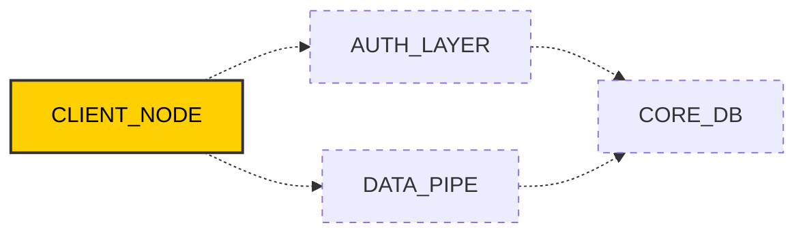

# Architecture

    
# mcsgs_sports
# Foobar

Foobar is a Python library for dealing with word pluralization.

## Installation

Use the package manager [pip](https://pip.pypa.io/en/stable/) to install foobar.

```bash
pip install foobar
```

## Usage

```python
import foobar

# returns 'words'
foobar.pluralize('word')

# returns 'geese'
foobar.pluralize('goose')

# returns 'phenomenon'
foobar.singularize('phenomena')
```

## Contributing

Pull requests are welcome. For major changes, please open an issue first
to discuss what you would like to change.

Please make sure to update tests as appropriate.

## License

[MIT](https://choosealicense.com/licenses/mit/)
